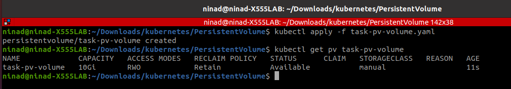
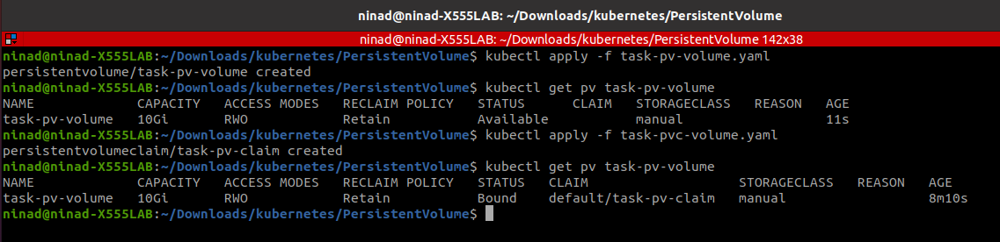
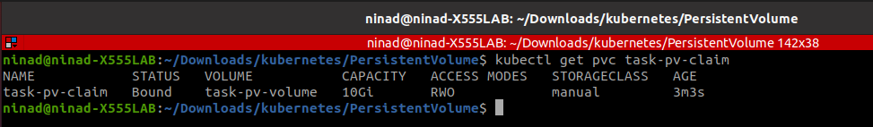
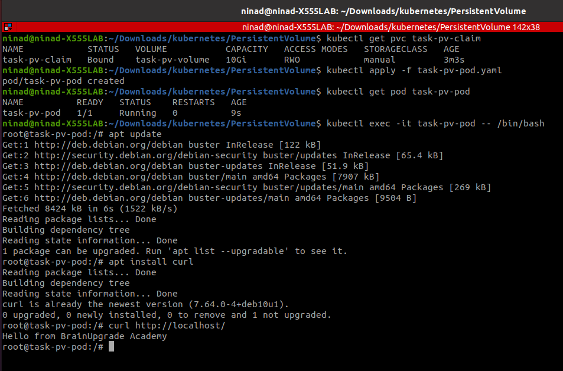

# Configuring a Pod to Use a PersistentVolume for Storage in Kubernetes

In this blog I will show how to Configuring a pod to use a PersistentVolume for Storage in Kubernetes. We will understand this by creating a PersistentVolumeClaim that is automatically bound to a suitable PersistentVolume. And we will also create a Pod that uses the PersistentVolumeClaim for storage.


## You need a few things.

- An existing Kubernetes Cluster or minikube.
- kubectl binary locally installed.
- Familiarize yourself with the material in Persistent Volumes.

## Create an index.html file on your Node

Open a shell to the single Node in your cluster. if you are using Minikube, you can open a shell to your Node by entering  
```sh
 minikube ssh 
 ```

 In your shell on that Node, create a /mnt/data directory by assuming that your Node uses "sudo" to run commands as the superuser
```sh
sudo mkdir /mnt/data
 ```

 In the /mnt/data directory, create an index.html file:

  ```sh
sudo sh -c "echo 'Hello from BrainUpgrade Academy' > /mnt/data/index.html"
 ```

 Test that the index.html file exists by following command :
```sh
cat /mnt/data/index.html
 ```

 The output should be:

 ```sh
Hello from BrainUpgrade Academy
 ```

## PersistentVolume

A PersistentVolume (PV) is a piece of storage in the cluster that has been provisioned by server/storage/cluster administrator or dynamically provisioned using Storage Classes. It is a resource in the cluster just like node.

In this blog, we will create a hostPath PersistentVolume. Kubernetes supports hostPath for development and testing on a single-node cluster. A hostPath PersistentVolume uses a file or directory on the Node to emulate network-attached storage.

Here is the configuration file for the hostPath PersistentVolume:

task-pv-volume.yaml

 ```sh
apiVersion: v1
kind: PersistentVolume
metadata:
  name: task-pv-volume
  labels:
    type: local
spec:
  storageClassName: manual
  capacity:
    storage: 10Gi
  accessModes:
    - ReadWriteOnce
  hostPath:
    path: "/mnt/data"
 ```

The configuration file specifies that the volume is at /mnt/data on the cluster's Node. The configuration also specifies a size of 10 gibibytes and an access mode of ReadWriteOnce, which means the volume can be mounted as read-write by a single Node. It defines the StorageClass name manual for the PersistentVolume, which will be used to bind PersistentVolumeClaim requests to this PersistentVolume.

Now Create the PersistentVolume:

 ```sh
kubectl apply -f task-pv-volume.yaml
 ```

 View information about the PersistentVolume:

```sh
kubectl get pv task-pv-volume
 ```



The output shows that the PersistentVolume has a STATUS of Available. This means it has not yet been bound to a PersistentVolumeClaim.


PersistentVolumeClaim

A PersistentVolumeClaim (PVC) is a request for storage by a user which can be attained from PV. It is similar to a Pod. Pods consume node resources and PVCs consume PV resources. Pods can request specific levels of resources (CPU and Memory). Claims can request specific size and access modes (e.g., they can be mounted ReadWriteOnce, ReadOnlyMany or ReadWriteMany.

The now next step is to create a PersistentVolumeClaim. Pods use PersistentVolumeClaims to request physical storage. In this blog, we will create a PersistentVolumeClaim that requests a volume of at least three gibibytes that can provide read-write access for at least one Node.

Here is the configuration file for the PersistentVolumeClaim:

```sh
apiVersion: v1
kind: PersistentVolumeClaim
metadata:
  name: task-pv-claim
spec:
  storageClassName: manual
  accessModes:
    - ReadWriteOnce
  resources:
    requests:
      storage: 3Gi
 ```

 Create the PersistentVolumeClaim:

```sh
kubectl apply -f task-pvc-volume.yaml
 ```

 After you create the PersistentVolumeClaim, the Kubernetes control plane looks for a PersistentVolume that satisfies the claim's requirements. If the control plane finds a suitable PersistentVolume with the same StorageClass, it binds the claim to the volume.

Look again at the PersistentVolume:

```sh
kubectl get pv task-pv-volume
 ```

Now the output shows a STATUS of Bound.




Look at the PersistentVolumeClaim:

```sh
kubectl get pvc task-pv-claim
```
The output shows that the PersistentVolumeClaim is bound to your PersistentVolume, task-pv-volume.





## Create a Pod

The next step is to create a Pod that uses your PersistentVolumeClaim as a volume.

Here is the configuration file for the Pod:

task-pv-pod.yaml

```sh
apiVersion: v1
kind: Pod
metadata:
  name: task-pv-pod
spec:
  volumes:
    - name: task-pv-storage
      persistentVolumeClaim:
        claimName: task-pv-claim
  containers:
    - name: task-pv-container
      image: nginx
      ports:
        - containerPort: 80
          name: "http-server"
      volumeMounts:
        - mountPath: "/usr/share/nginx/html"
          name: task-pv-storage

```

Notice that the Pod's configuration file specifies a PersistentVolumeClaim, but it does not specify a PersistentVolume. From the Pod's point of view, the claim is a volume.

Create the Pod:

```sh
kubectl apply -f task-pv-pod.yaml
```
Verify that the container in the Pod is running;

```sh
kubectl get pod task-pv-pod
```
Get a shell to the container running in your Pod:

```sh
kubectl exec -it task-pv-pod -- /bin/bash
```

In minikube shell, verify that nginx is serving the index.html file from the hostPath volume:

```sh
apt update
apt install curl
curl http://localhost/
```

The output shows the text that you wrote to the index.html file on the hostPath volume:



If you see that message, you have successfully configured a Pod to use storage from a PersistentVolumeClaim.


## Clean up

Delete the Pod, the PersistentVolumeClaim and the PersistentVolume:


```sh
kubectl delete pod task-pv-pod
kubectl delete pvc task-pv-claim
kubectl delete pv task-pv-volume
```

If you don't already have a shell open to the Node in your cluster, open a new shell the same way that you did earlier.

In the shell on your Node, remove the file and directory that you created:

```sh
sudo rm /mnt/data/index.html
sudo rmdir /mnt/data
```
You can now close the shell to your Node.

## Conclusion

This article demonstrated how to Configuring a pod to use a PersistentVolume for Storage in Kubernetes.To understand the cocept of PersistentVolume and PersistentVolumeClaim in real life example, Suppose your parents have a lot of money(PV) but they only provide you once you request them according to your needs(PVC) ;-)

# About The Author

The author, [Ninad Samudre](https://www.linkedin.com/in/ninad-samudre-19439b1a5/), is The Cloud Application Manager @ Brain Upgrade where he manage IoT-based Fleet Management Platform that runs on a Kubernetes Cluster on AWS Amazon.

# About Brain Upgrade Academy

We, at Brain Upgrade, offer Kubernetes Consulting services to our clients including Up Skilling (training) of clients teams thus facilitate efficient utilization of Kubernetes Platform.  To know more on the Kubernetes please visit [www.brainupgrade.in/blog](www.brainupgrade.in/blog) and register on [www.brainupgrade.in/enroll](www.brainupgrade.in/enroll) to equip yourself with Kubernetes skills.

# Why Brain Upgrade

We at Brain Upgrade, partner with our customers in the digital transformation of their businesses by providing: 

Technology Consulting in product development, IoT, DevOps, Cloud, Containerization, Big Data Analysis with a heavy focus on Open source technologies. 
Training the IT workforce on the latest cloud technologies such as Kubernetes, Docker, AI, ML, etc. 

You may want to register for the upcoming trainings on [https://brainupgrade.in/enroll](https://brainupgrade.in/enroll)