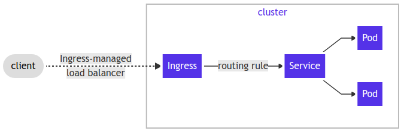
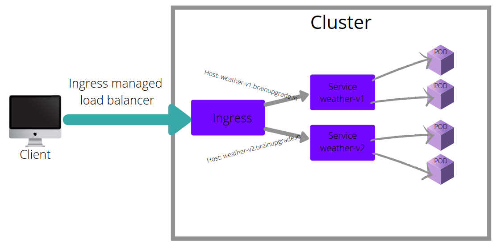

# Expose your app to the Internet using Ingress Controller & save 100s of dollars on AWS Load Balancer

Do you have many intenet facing applications and worried about the cost of Load Balancer?  Well, this article will help you expose your applications to the Internet using a single Load Balancer saving you hundreds of dollars. 

## What is Ingress?

Let us first understand what the Ingress is.  Ingress is an API object that manages external access to the services in a cluster and may provide load balancing, SSL termination and name-based virtual hosting.



Source: [kubernetes.io](https://kubernetes.io/docs/concepts/services-networking/ingress/)

You will see how Load Balancing, SSL termination and Name-based virtual hosting work as I take you through the article with examples.

## What is Ingress Controller?

While traffic routing rules are defined by Ingress, those are fulfilled by Ingress Controller.

If you don't have Ingress Controller running in your cluster, then you can run the one using below commands.

```
helm repo add nginx-stable https://helm.nginx.com/stable
helm repo update
helm install --name ingress nginx-stable/nginx-ingress
```

You may also choose to install Ingress Controller from any of the ones listed here [https://kubernetes.io/docs/concepts/services-networking/ingress-controllers/](https://kubernetes.io/docs/concepts/services-networking/ingress-controllers/)

## Example - Weather App

Let me demonstrate the above using weather app. This app provides weather info for the selected city. This is a tiny app with embedded database and a simple page to serve the users.

Below is the yaml for deploying the app.

```
apiVersion: apps/v1
kind: Deployment
metadata:
  labels:
    app: weather
  name: weather
spec:
  replicas: 1
  selector:
    matchLabels:
      app: weather
  template:
    metadata:
      labels:
        app: weather
    spec:
      containers:
      - image: brainupgrade/weather:monolith
        name: weather
        ports:
        - containerPort: 8080
```

Once the app is deployed & running in the Kubernetes cluster, we can create a service so that requests to the application can be proxied to the application pod. 

```
apiVersion: v1
kind: Service
metadata:
  name: weather-service
spec:
  type: ClusterIP
  ports:
    - name: app
      port: 80
      targetPort: 8080
  selector:
    app: weather
```

Now it is time to wire the app using Ingress definition.  See below:

```
apiVersion: networking.k8s.io/v1beta1 
kind: Ingress
metadata:
  name: weather.brainupgrade.in
  annotations:
    cert-manager.io/cluster-issuer: letsencrypt-prod
    nginx.ingress.kubernetes.io/rewrite-target: /$1
    nginx.ingress.kubernetes.io/use-regex: "true"
    kubernetes.io/tls-acme: "true"
    nginx.ingress.kubernetes.io/enable-cors: "true"
    kong.ingress.kubernetes.io/force-ssl-redirect: "true"
    kubernetes.io/ingress.class: "nginx"
spec:
  tls:
  - hosts:
    - weather.brainupgrade.in
    secretName: weather.brainupgrade.in
  rules:
    - host: weather.brainupgrade.in
      http:
        paths:
          - path: /
            backend:
              serviceName: weather-service
              servicePort: 80
```

The moment you deploy the above Ingress definition, Ingress Controller in your cluster will implement the rules you specified and Voila! your app is now an Internet Application!

## Load Balancing

All the application workloads i.e. pods associated with the service act as backends to the Ingress. Ingress proxies internet requests to the Service that routes the requests to any of the pods using rudimentary round robin algorithm thus doing Load Balancing.

## SSL Termination

Internet facing applications mostly have SSL enabled (HTTPS URL). When requests land in the cluster, further routing of requests within the cluster may not need SSL and to gain more performance, SSL is terminated at Ingress level.

## Name based Virtual Hosting

This technique has been used by many web servers (apache, nginx etc) wherein requests for multiple domains are routed to the same server.

In the Kubernetes world, using Ingress definition this concept is further extended to route requests for multiple domains to the relevant app components that usually run on many servers / nodes.

See the example below:




```
apiVersion: networking.k8s.io/v1
kind: Ingress
metadata:
  name: name-based-vhosts
spec:
  rules:
  - host: weather-v1.brainupgrade.in
    http:
      paths:
      - pathType: Prefix
        path: "/"
        backend:
          service:
            name: weather-v1
            port:
              number: 80
  - host: weather-v2.brainupgrade.in
    http:
      paths:
      - pathType: Prefix
        path: "/"
        backend:
          service:
            name: weather-v2
            port:
              number: 80
  - http:
      paths:
      - pathType: Prefix
        path: "/"
        backend:
          service:
            name: weather
            port:
              number: 80
```

In the example above, requests for the host weather-v1.brainupgrade.in are routed to weather-v1 service, requests for the host weather-v2.brainupgrade.in are routed to weather-v2 service and requests landing on the load balancer with no HOST header are routed to the service weather.

## Conclusion

In this article, we explored in details How Ingress works along with Ingress Controller and its benefits like Load Balancing, SSL Termination & Name based Virtual Hosting.

#### Tags: #ingress #devops #ingresscontroller #kubernetes #vhost 

# About The Author

The author, [Rajesh G](https://www.linkedin.com/in/rajesh-g-b48495/), is The Chief Architect @ Brain Upgrade Academy where he has designed the IoT-based Fleet Management Platform that runs on a Kubernetes Cluster on AWS Amazon.  He is also a certified Kubernetes Administrator and TOGAF certified Enterprise Architect.
Rajesh led various digital transformation initiatives for Fortune 500 Fin Tech companies. Over the last 20+ years, he has been part of many successful technology startups.

# About Brain Upgrade Academy

We, at Brain Upgrade, offer Kubernetes Consulting services to our clients including Up Skilling (training) of clients teams thus facilitate efficient utilization of Kubernetes Platform.  To know more on the Kubernetes please visit [www.brainupgrade.in/blog](www.brainupgrade.in/blog) and register on [www.brainupgrade.in/enroll](www.brainupgrade.in/enroll) to equip yourself with Kubernetes skills.

# Why Brain Upgrade

We at Brain Upgrade, partner with our customers in the digital transformation of their businesses by providing: 

Technology Consulting in product development, IoT, DevOps, Cloud, Containerization, Big Data Analysis with a heavy focus on Open source technologies. 
Training the IT workforce on the latest cloud technologies such as Kubernetes, Docker, AI, ML, etc. 

You may want to register for the upcoming trainings on [https://brainupgrade.in/enroll](https://brainupgrade.in/enroll)