[](https://cicd.brainupgrade.in/job/weather-service/)

# Scalable Jenkins on Kubernetes Cluster & Pipeline for Automated CI CD (Jenkins - Github Integration)

Setting up scalable Jenkins on kubernetes can be a daunting dask.  This article demonstrate not only How to setup Scalable Jenkins on Kubernetes but also how to integrate Jenkins into Github so that whenever any Pull Request is requested on a branch, build is automatically triggered and results are made available to the branch admin to review before merging the Pull Request.

Let us first get the scalable Jenkins up before setting up pipeline for automated CI CD.

Before we go through the steps, here is the brief on the Master and Slave node docker images

## Jenkins Master Node
Jenkins master uses the image ``` brainupgrade/jenkins:2.274jdk11x ```

This image has many plugins required for smooth CD on kubernetes.  To know the image content, Dockerfile (./master/Dockerfile) is kept here.  Following  plugins are made avaialbe as part of this image to save time:
 - ssh-slaves
 - email-ext
 - mailer
 - slack
 - htmlpublisher
 - greenballs
 - simple-theme-plugin
 - kubernetes
 - workflow-aggregator
 - blueocean 
 - sonar 
 - maven-plugin

## Jenkins Slave Node

Jenkins slave uses the image ```  brainupgrade/jnlp-slave:1.0.0 ```

This image is based on openjdk11 containing maven, docker runtime so that spring boot 
project can be checked out, maven built including docker image building & deployment.

## Steps
Below is the step by step guide to make it happen.  

### Launch Jenkins master
Run below kubernetes configurations
```sh
kubectl create ns jenkins
kubectl apply -f rbac.yaml
kubectl apply -f deploy.yaml
kubectl apply -f service.yaml
```

### Secure the master
Once Jenkins master server is deployed, it would take few minutes to get the UI up and running 
To access UI, run below
```sh
kubectl port-forward deploy/jenkins 8080:8080
```
and launch URL <http://localhost:8080> on the browser

Go to <http://localhost:8080/configureSecurity/> and secure the server by enabling security as shown in the below picture.

Once you save it, you will get an option to set username and password.

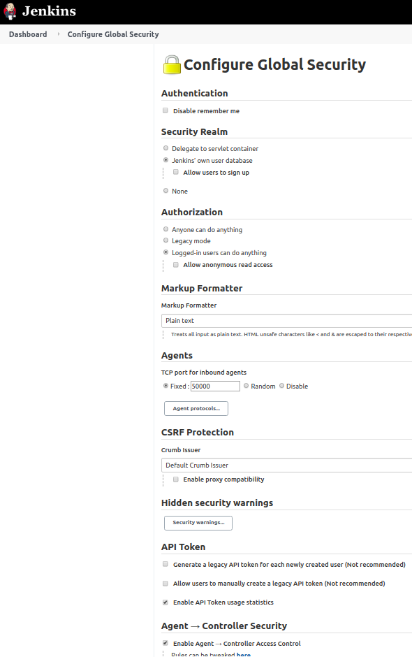

After login, come back to this URL again and select tick mark to Agent - Controller Security. This option gets visible after setting up username and password.

### Configure the Kubernetes plugin as shown in the snapshots below
Now go to the URL: http://localhost:8080/configureClouds and key in the configuration as shown in the below snapshots.

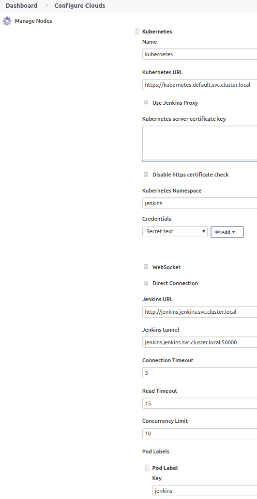
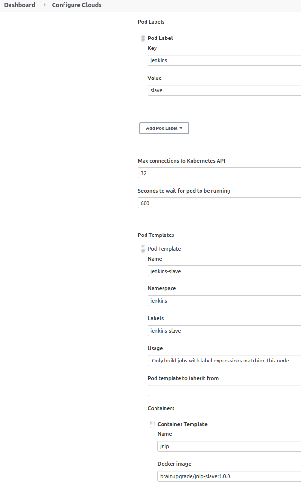
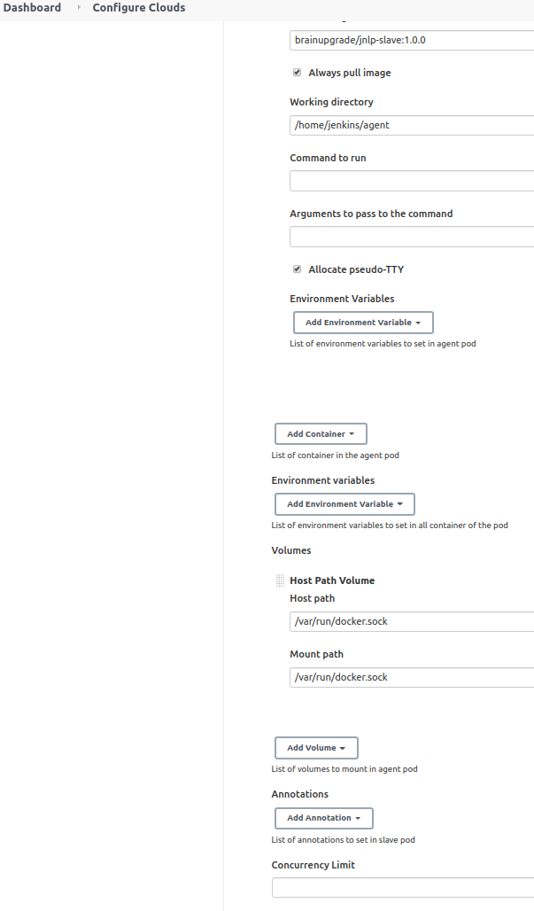
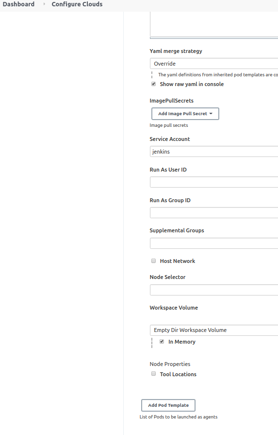

### Setup Global credentials
To test the docker commands especially login, first setup the global credentials as shown in below

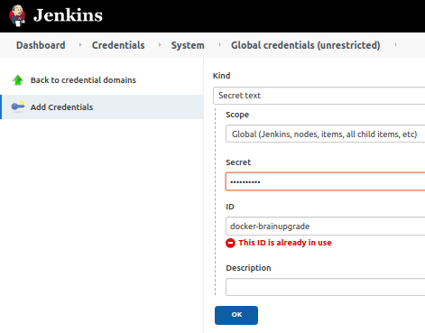

### Create Build Job
Create docker-test job as Pipeline, click OK and insert below text in the pipeline block
```sh
pipeline {
    agent {
        kubernetes{
            label 'jenkins-slave'
        }
    }
    environment{
        DOCKER_USERNAME = 'brainupgrade'
        DOCKER_PASSWORD = credentials('docker-brainupgrade')
    }
    stages {
        stage('docker login') {
            steps{
                sh(script: """
                    docker login -u $DOCKER_USERNAME -p $DOCKER_PASSWORD
                """, returnStdout: true) 
            }
        }
    }
}
```

Click SAVE

### Test the pipeline
Run the docker-test job and you would see that a pod will be launched by Jenkins master to run the docker-test build job and the pod will be terminated immediately build completes.

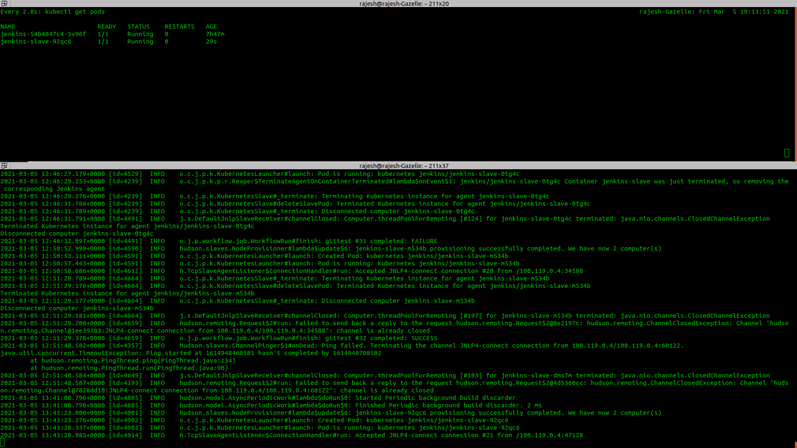

Once build job completes, then build pod is terminated

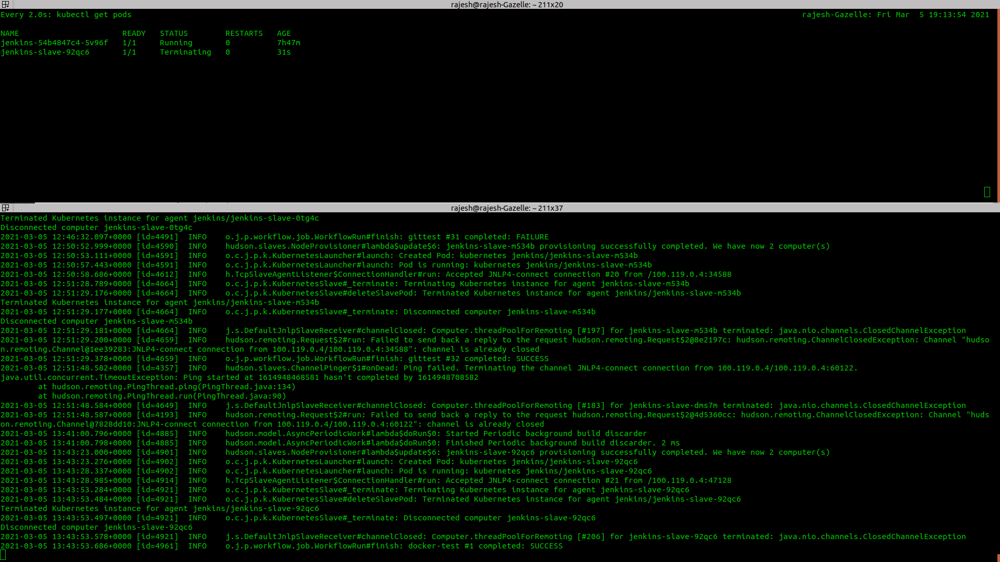

## Automated CI CD
To illustrate, automated CI CD, I have setup an example github project 
[Weather Service](https://github.com/brainupgrade-in/weather-service)
Also created a branch named **jenkins** and whenever any contributions are made to this branch via pull request, branch / project admin can review the pull request, view the build and test status before merging into **jenkins** branch as seen in the below snapshot

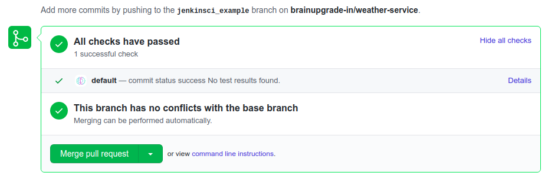

On Jenkins, setup a build job named weather-service and type pipeline, click OK and then scroll down to insert content of this [pipeline file](./pipleline/Jenkisnfile) into the pipeline section.

Also, install below plugins
 - GitHub pull request builder

Now generate access token using https://github.com/settings/tokens/new  (select repo:status)

Create Jenkings Credentials (type: Secret text) using above access token say github-bu-token

Create webhook using your Github repo settings
1. Insert https://<Your_Jenkins_Public_URL>/ghprbhook/ 
2. Event trigger - Select individual events (Pull requests, Issue comments)
So that whenever any pull request is created, Github can notify your Jenkins URL

Configure GitHub Server here http://localhost:8080/configure

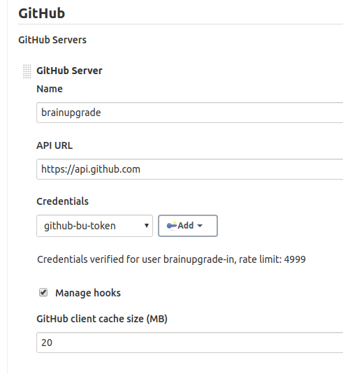

Scroll down and configure Github Pull Request Builder and choose the right credentials 

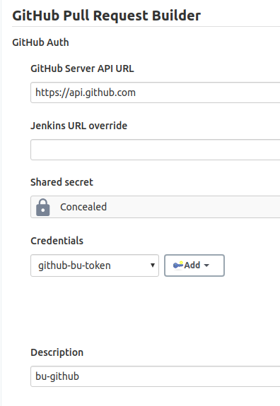

Create new job say weather-service, select pipeline and click OK

Select Github Pull Request Builder, see the below snapshot

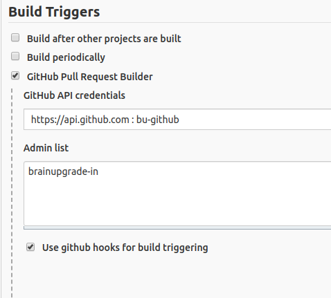

Click on advanced and insert whitelist target branch say jenkins. You should also select **Build every pull request automatically without asking** to ensure that every pull request is good enough in terms of build and test quality before merging


## Build Status
To show the build status on your main Github page, install the plugin  ``` embeddable-build-status``` and goto your build job and click  on this plugin  link to generate URL that would look similar to the below

```
[](https://<Your_Jenkins_Public_URL>/job/<job_name>/)

```
[](https://cicd.brainupgrade.in/job/weather-service/)
 

## Kubernetes Cluster Info
Below is the info on the tool used to setup Kubernetes cluster and its version

- Kubernetes Server 1.19.7
- Cluster Management Tool - kops
- Cloud Provider AWS

## Conclusion
This article demonstrated How to setup Jenkins Pipeline to achieve automated CI CD including Github and Jenkins integration.  The moment Git Pull request is raised on a particular branch, build is triggered and results are made avaialble to the branch admin to review before merging the pull request.

# About Author

The author, [Rajesh G](https://www.linkedin.com/in/rajesh-g-b48495/), is The Chief Architect @ Brain Upgrade Academy where he has designed the IoT-based Fleet Management Platform that runs on a Kubernetes Cluster on AWS Amazon.

# About Brain Upgrade Academy

We, at Brain Upgrade, offer Kubernetes Consulting services to our clients including Up Skilling (training) of clients teams thus facilitate efficient utilization of Kubernetes Platform.  To know more on the Kubernetes please visit [www.brainupgrade.in/blog](www.brainupgrade.in/blog) and register on [www.brainupgrade.in/enroll](www.brainupgrade.in/enroll) to equip yourself with Kubernetes skills.

# Why Brain Upgrade

We at Brain Upgrade, partner with our customers in the digital transformation of their businesses by providing: 

Technology Consulting in product development, IoT, DevOps, Cloud, Containerization, Big Data Analysis with a heavy focus on Open source technologies. 
Training the IT workforce on the latest cloud technologies such as Kubernetes, Docker, AI, ML, etc. 

You may want to register for the upcoming trainings on [https://brainupgrade.in/enroll](https://brainupgrade.in/enroll)