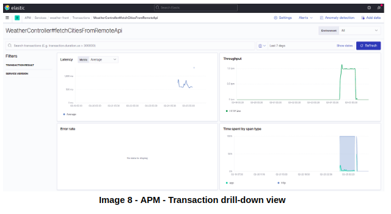
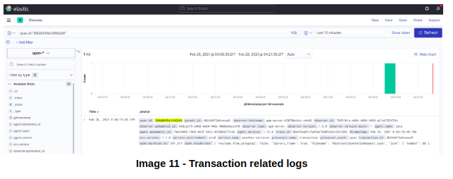

 

# Microservices Observability on Kubernetes

A Complete Guide to deployment, logging, distributed tracing, performance, and metrics monitoring including cluster health

Are you looking for implementing Observability but clueless on How to implement it on Kubernetes? Well, well… This could be the blog you have been searching for.

#### Tags / Keywords: #observability #microservices #performance #monitoring #metrics #apm #log-analytics #elk #fluentd #prometheus #grafana #elasticsearch #kibana #logs #tracing #distributed-tracing #kubernetes #k8s #cluster #devops

First, let us understand what Observability is.  This term originated in Control system engineering and defined as “a measure of how well internal states of a system can be inferred by knowledge of its external outputs”.  In simple terms, observability means adequate insights into the system facilitating corrective action.

There are three main pillars of Observability and those are 

## Event Logs

A record of an event that happened in the system.  Events are discrete and contain metadata about the system when they occur.

## Tracing

The system usually consists of many parts/components that work cohesively to provide certain meaningful functionality.  For a particular functionality, tracing of request and response flow across distributed components is critical for effective debugging / troubleshooting.

## Metrics
Performance of the system measured over a period of time is termed as metrics.  These indicate the service level of a system.

Now the question is, how do we get this implemented in the Kubernetes cluster for the microservices components?

## Microservices - Kubernetes App

Below is an example that can act as a guide for your microservices-based production app.

Let us consider a microservice app that provides weather information for the given city.


1. Weather-front: Component that comprises frontend UI to input a city name to view the weather info.  Please see the above screenshot (Ref: Image 1 – Weather App – Frontend).
2. Weather-services: Component that takes the city as input and calls an external weather API to retrieve weather details
3. Weather-db: This component is the maria database component where weather data, that is pulled in the background for the city being followed, is stored.

Using Kubernetes Deployment object, above microservices are deployed, and below is the output of kubectl get deploy command (Ref: Image 2 – Microservices components deployment)


Below are the images to be used for the deployment of microservices components.

```
Weather-front:
- image: brainupgrade/weather:microservices-front
  imagePullPolicy: Always
  name: weather-front
Weather-services:
- image: brainupgrade/weather-services:2.0.0
  imagePullPolicy: Always
  name: weather-services
Weather-db:
- image: mariadb:10.3
  name: mariadb
  ports:
  - containerPort: 3306
    name: mariadb
```

## Observability - Pillar One - Event Logs

To get the first pillar of Observability, let us install the EFK stack: Elasticsearch, Fluentd, and Kibana, and below are simple installation steps. See below

Elasticsearch & Kibana

```
helm repo add elastic https://helm.elastic.co
helm repo update
helm install --name elasticsearch elastic/elasticsearch --set replicas=1 --namespace elasticsearch
helm install --name kibana elastic/kibana
```

Fluentd
```
containers:
- name: fluentd
  imagePullPolicy: "Always"
  image: fluent/fluentd-kubernetes-daemonset:v1.12.0-debian-elasticsearch7-1.0
  env:
    - name:  FLUENT_ELASTICSEARCH_HOST
      value: "elasticsearch-master.elasticsearch.svc.cluster.local"
    - name:  FLUENT_ELASTICSEARCH_PORT
      value: "9200"
```

Post-installation, you can launch the Kibana dashboard, and below is what you would see (Ref: Image 3)


Once Fluentd starts below is what you would see.  Fluentd is run as Daemonset (Ref: Image 4)


And soon logs will start getting into elasticsearch which  can be explored on Kibana as below (Ref: Image 5)


Now the first pillar of Observability is implemented,  let us focus on the next i.e. distributed tracing.

# Observability - Second Pillar - (Distributed) tracing

For distributed tracing, we have few alternatives in place for java apps like Zipkin, Jaeger, Elasticsesarch APM, etc.

Since we have the EFK stack already in place, let us use APM – Application Performance Monitoring agent provided by Elasticsearch.  First, let us start the APM server as Kubernetes Deployment. See below

Elastic APM Server deployment snippet

```
containers:
- name: apm-server
  image: docker.elastic.co/apm/apm-server:7.5.0
  ports:
  - containerPort: 8200
    name: apm-port
```

Once the APM server is running, then add the APM agent in microservices in a non-invasive method.  See below the code snippet used for weather-front microservices.  Similar code snippets should be used for the weather-services component as well.

Snippet of APM agent in microservice weather-front

```
initContainers:
- name: elastic-java-agent
  image: docker.elastic.co/observability/apm-agent-java:1.12.0
  volumeMounts:
  - mountPath: /elastic/apm/agent
    name: elastic-apm-agent
  command: ['cp', '-v', '/usr/agent/elastic-apm-agent.jar', '/elastic/apm/agent']   
containers:
  - image: brainupgrade/weather:microservices-front
    imagePullPolicy: Always
    name: weather-front
    volumeMounts:
    - mountPath: /elastic/apm/agent
      name: elastic-apm-agent         
    env:
      - name: ELASTIC_APM_SERVER_URL
        value: "http://apm-server.elasticsearch.svc.cluster.local:8200"
      - name: ELASTIC_APM_SERVICE_NAME
        value: "weather-front"
      - name: ELASTIC_APM_APPLICATION_PACKAGES
        value: "in.brainupgrade"
      - name: ELASTIC_APM_ENVIRONMENT
        value: prod
      - name: ELASTIC_APM_LOG_LEVEL
        value: DEBUG
      - name: JAVA_TOOL_OPTIONS
        value: -javaagent:/elastic/apm/agent/elastic-apm-agent.jar
```

Post redeployment of the microservices components, you can navigate to the Observability -> APM console on Kibana to see services appearing (Ref: Image 6)


Once you click on the weather-front service, you can see the transactions


Click on any of the transactions and you would see a drill-down view with more details on the transaction including Latency, throughput, Trace Sample, etc.




The above screenshot captures the distributed tracing where linkage of weather-front and weather-services microservices clearly depicted. Clicking on the Trace Sample would take you to the transaction details


On the transaction details, Actions dropdown provides an option to select traversing the logs for this particular transaction



So by now, two pillars of Observability are covered 1. Event Logs & 2. Distributed Tracing

## Observability - Third Pillar - Metrics

To implement the third pillar i.e. Metrics, we can use the APM Services dashboard where Latency, Throughput, and Error rates are captured. 


Besides, we can use the spring boot Prometheus actuator plugin to collect the metrics data. For this, first, install Prometheus and Grafana using below simple commands

Prometheus & Grafana

```
helm repo add prometheus-community  https://prometheus-community.github.io/helm-charts
helm repo add grafana https://grafana.github.io/helm-charts
helm repo update
helm install --name prometheus prometheus-community/prometheus
helm install --name grafana grafana/grafana
```

Once Prometheus and Grafana is up, then add below to the microservices and redeploy

Prometheus metrics injection - Spring boot microservice

```
template:
   metadata:
     labels:
       app: weather-services
     annotations:
       prometheus.io/scrape: "true"
       prometheus.io/port: "8888"
       prometheus.io/path: /actuator/prometheus
     containers:
       - image: brainupgrade/weather-services:2.0.0
         imagePullPolicy: Always
         name: weather-services
         volumeMounts:
         - mountPath: /elastic/apm/agent
           name: elastic-apm-agent         
         env:
           - name: management.endpoints.web.exposure.include
             value: "*"
           - name: spring.application.name
             value: weather-services
           - name: management.server.port
             value: "8888"
           - name: management.metrics.web.server.request.autotime.enabled
             value: "true"
           - name: management.metrics.tags.application
             value: weather-services
```

Once microservices are redeployed, open the grafana and import dashboard id 12685 and select the microservice that you want to see the metrics for.  See below for weather-front


And to see the whole cluster metrics,  import the grafana dashboard id 6417 and you would see something like below


# Grafana Dashboards
4701 12685 - Spring boot microservices
6417 11074 - Cluster 
9964 - Jenkins


# About The Author

The author, [Rajesh G](https://www.linkedin.com/in/rajesh-g-b48495/), is The Chief Architect @ Brain Upgrade Academy where he has designed the IoT-based Fleet Management Platform that runs on a Kubernetes Cluster on AWS Amazon.  He is also a certified Kubernetes Administrator and TOGAF certified Enterprise Architect.
Rajesh led various digital transformation initiatives for Fortune 500 FinTech companies. Over the last 20+ years, he has been part of many successful technology startups.

# About Brain Upgrade Academy

We, at Brain Upgrade, offer Kubernetes Consulting services to our clients including Up Skilling (training) of clients teams thus facilitate efficient utilization of Kubernetes Platform.  To know more on the Kubernetes please visit [www.brainupgrade.in/blog](www.brainupgrade.in/blog) and register on [www.brainupgrade.in/enroll](www.brainupgrade.in/enroll) to equip yourself with Kubernetes skills.

# Why Brain Upgrade

We at Brain Upgrade, partner with our customers in the digital transformation of their businesses by providing: 

Technology Consulting in product development, IoT, DevOps, Cloud, Containerization, Big Data Analysis with a heavy focus on Open source technologies. 
Training the IT workforce on the latest cloud technologies such as Kubernetes, Docker, AI, ML, etc. 

You may want to register for the upcoming trainings on [https://brainupgrade.in/enroll](https://brainupgrade.in/enroll)

#### Publications
This article is published on the following portals / publications:
<https://dzone.com/articles/microservices-with-observability-on-kubernetes>
<https://www.linkedin.com/pulse/microservices-observability-kubernetes-rajesh-g-/>
<https://rajeshgheware.medium.com/microservices-on-kubernetes-9693c048aa29>
<https://dev.to/rajeshgheware/microservices-observability-on-kubernetes-2546>